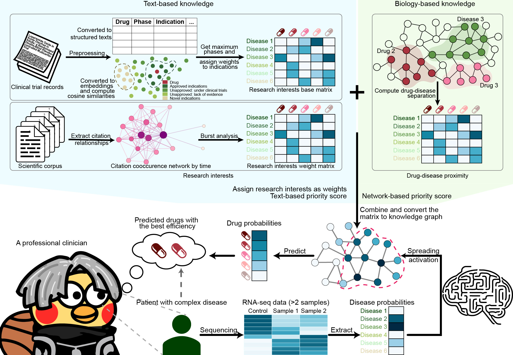

# Labyrinth

[](https://github.com/randef1ned/labyrinth)
[](https://www.repostatus.org/#wip)
[](https://www.gnu.org/licenses/old-licenses/gpl-2.0.en.html)
[](https://app.codacy.com/gh/randef1ned/labyrinth/dashboard?utm_source=gh&utm_medium=referral&utm_content=&utm_campaign=Badge_grade)
[](https://makeapullrequest.com)
[](https://github.com/randef1ned/labyrinth/commits/master)
[](https://github.com/randef1ned/labyrinth)

Labyrinth is a human-inspired computational framework for personalized drug prioritization.

## Introduction

`labyrinth` is a computational framework designed at drug prioritization at both the population and individual levels. It integrates multiple sources of prior medical knowledge, including:

- Clinical trial information.
- Co-occurrence networks from literature citations.
- Drug-target interactions.
- Drug-indication importance.
- Disease-drug distance.

`labyrinth` emphasizes the importance of aligning computational models with intuitive human reasoning. Thus, it employs a human-like knowledge retrieval methodology to identify potential drug candidates for various diseases. `labyrinth` aims to strike a balance between predictive accuracy and model interpretability, as demonstrated by its robust performance across diverse diseases, evaluated using ROC-AUC metrics.




## A notice on operating system compatibility

I developed and tested `labyrinth` on Fedora Linux version 38 and 39. While this package does not contain any operating system-specific code, it has not been tested on other operating systems. In theory, `labyrinth` should work on other Unix-like operating systems as long as the required dependencies are installed.

We recommended these dependencies to be installed:

- **R (≥ 4.3.0)**: We developed this R package using R version 4.3.x.
- **Python**: Python is required for drawing plots in demos. It is recommended to have Python and `seaborn` installed, as the `reticulate` package will use the system's Python installation.
- **OpenMP**: This package uses OpenMP for parallelization and multithreading if OpenMP exists. Having OpenMP installed can significantly improve performance.
- **Intel oneAPI Math Kernel Library (oneMKL)**: This library can further enhance mathematical performance, especially on Intel processors. oneMKL is not required but highly recommended.

It would takes less than ten minutes to install this package. If you encounter any issues while running this package on other operating system, please open an issue.


## Before installation

Before installation, we recommended you install Intel oneAPI Math Kernel Library (oneMKL) to optimize the computational performance of linear algebra.

Windows users can download oneMKL from [Intel's website](https://www.intel.com/content/www/us/en/developer/tools/oneapi/onemkl-download.html) and install it in the default directory. The default directory is: `C:\Program Files (x86)\Intel\oneAPI`.

Debian and Ubuntu users can download oneMKL using apt in the non-free repo:

``` bash
# Install oneMKL version 2020.4.304-4
sudo apt install intel-mkl-full
```

Or using the Intel repo:

``` bash
# Set up the repository and signed the entry
wget -O- https://apt.repos.intel.com/intel-gpg-keys/GPG-PUB-KEY-INTEL-SW-PRODUCTS.PUB \
| gpg --dearmor | sudo tee /usr/share/keyrings/oneapi-archive-keyring.gpg > /dev/null
echo "deb [signed-by=/usr/share/keyrings/oneapi-archive-keyring.gpg] https://apt.repos.intel.com/oneapi all main" | sudo tee /etc/apt/sources.list.d/oneAPI.list
# Update the package list
sudo apt update
# Install the latest oneMKL (version 2024.1)
sudo apt install intel-oneapi-mkl
```

Fedora users can download oneMKL by using dnf:

``` bash
# Create dnf repository file
tee > /tmp/oneAPI.repo << EOF
[oneAPI]
name=Intel® oneAPI repository
baseurl=https://yum.repos.intel.com/oneapi
enabled=1
gpgcheck=1
repo_gpgcheck=1
gpgkey=https://yum.repos.intel.com/intel-gpg-keys/GPG-PUB-KEY-INTEL-SW-PRODUCTS.PUB
EOF
sudo mv /tmp/oneAPI.repo /etc/yum.repos.d
# Install the latest oneMKL (version 2024.0)
sudo dnf install intel-oneapi-mkl
```


## Installation

Install `labyrinth` using:

``` r
install.packages(c('devtools', 'BiocManager'))
remotes::install_github("randef1ned/labyrinth")
```

Or you can download the pre-built binary packages from [Releases](https://github.com/randef1ned/labyrinth/releases).


## Usage

Load the package using `library(labyrinth)`. We provide a vignette for the package that can be called using: `vignette("labyrinth")`. Alternatively, you can view the online version on [GitHub](doc/labyrinth_knit.md), or [`pkgdown` documentation](https://labyrinth.yinchun.su/articles/labyrinth). The examples I provided would take several minutes to run on a normal desktop computer. Basically that is all you have to know.

[This documentation](doc/training_knit.md) contains information about the contents and the necessary information for training the model used in this project. The `tools/` folder contains all the code and scripts required for constructing your own model, so that you can understand the technical details. Besides, you can refer to [this documentation](doc/preface_knit.md) for the background and inspirations behind the overall workflow of `labyrinth.


## Changelog

Changelog: [see this](NEWS.md)

<!--
## Star history

[](https://star-history.com/#randef1ned/labyrinth&Date)
-->
