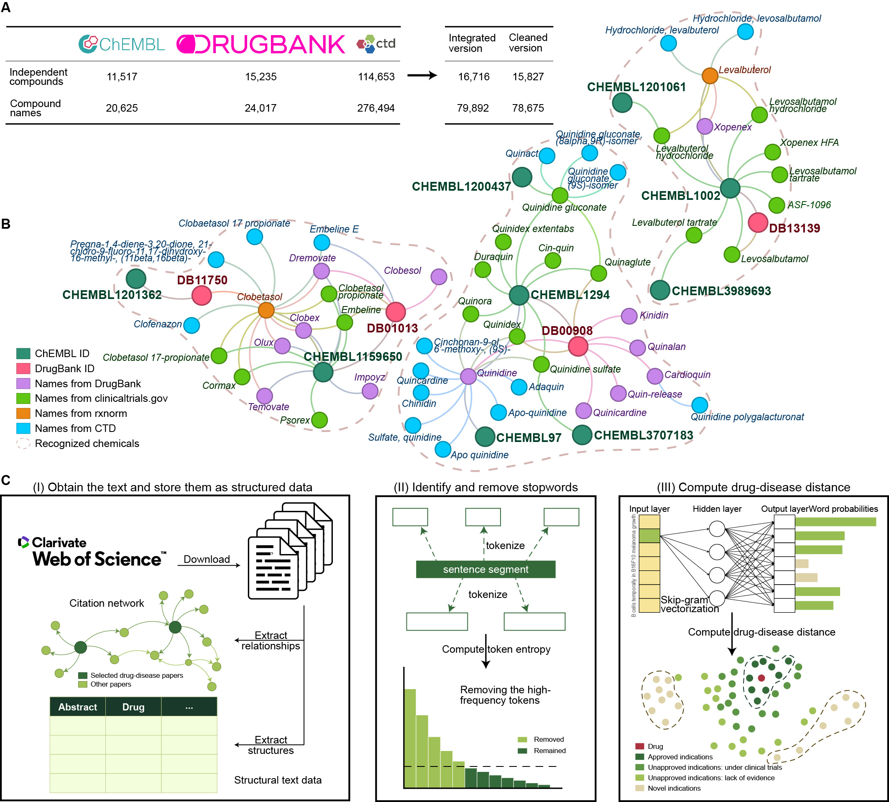

## Setting up environment

I developed and tested `labyrinth` on [Fedora Linux](https://fedoraproject.org) version 38 and 39. While this package does not contain any operating system-specific code, it has not been tested on other operating systems. In theory, `labyrinth` should work on other Unix-like operating systems as long as the required dependencies are installed.

If you need to rebuild this model, it is **strongly recommended** to use Fedora Linux or its downstream operating system (i.e., Red Hat Enterprise Linux, CentOS Stream, Rocky Linux, Alma Linux) and follow the instructions above. Using a different environment may lead to unexpected issues or differences in results.

### Red Hat Enterprise Linux, Rocky Linux, Alma Linux, and CentOS Stream

The Fedora RPMs for R have been ported to CentOS/RHEL by the project Extra Packages for Enterprise Linux (EPEL). These RPMs are also compatible with distributions derived from CentOS/RHEL. 
To use the EPEL repository, it is sufficient to download and install the appropriate `epel-release` RPM. Then R can be installed as described in the **Fedora** section.

1. CentOS Stream 9

   ``` bash
   sudo dnf config-manager --set-enabled crb
   sudo dnf install epel-release epel-next-release -y
   ```

2. Rocky Linux 9, AlmaLinux 9, and RHEL 9

   ``` bash
   sudo dnf config-manager --set-enabled crb
   sudo dnf install https://dl.fedoraproject.org/pub/epel/epel-release-latest-9.noarch.rpm -y
    ```

3. CentOS Stream 8

   ``` bash
   sudo dnf config-manager --set-enabled powertools
   sudo dnf install epel-release epel-next-release -y
   ```

4. Rocky Linux 8, AlmaLinux 8, and RHEL 8

   ``` bash
   sudo dnf config-manager --set-enabled powertools
   sudo dnf install https://dl.fedoraproject.org/pub/epel/epel-release-latest-8.noarch.rpm -y
   ```

5. CentOS 7 and RHEL 7

   ``` bash
   sudo yum-config-manager --enable extras
   sudo yum install dnf -y
   sudo dnf install https://dl.fedoraproject.org/pub/epel/epel-release-latest-7.noarch.rpm -y
   
   # Use puias computational repo
   curl -o /tmp/RPM-GPG-KEY-springdale http://springdale.math.ias.edu/data/puias/7/x86_64/os/RPM-GPG-KEY-springdale
   sudo mv /tmp/RPM-GPG-KEY-springdale /etc/pki/rpm-gpg/RPM-GPG-KEY-springdale
   
   tee > /tmp/puias_computational.repo << EOF
   [puias_computational]
   name=PUIAS computational Base $releasever - $basearch
   mirrorlist=http://puias.math.ias.edu/data/puias/computational/$releasever/$basearch/mirrorlist
   # baseurl=http://puias.math.ias.edu/data/puias/computational/$releasever/$basearch
   enabled=1
   gpgcheck=1
   gpgkey=file:///etc/pki/rpm-gpg/RPM-GPG-KEY-puias
   EOF
   sudo mv /tmp/puias_computational.repo /etc/yum.repos.d
   
   sudo dnf update -y
   ```

### Fedora

``` bash
sudo dnf install R @development-tools automake libxml2-devel libcurl-devel fontconfig-devel openssl-devel harfbuzz-devel fribidi-devel libgit2-devel freetype-devel libpng-devel libtiff-devel libjpeg-devel python3-pip ghostscript pandoc R-flexiblas flexiblas-*
```

### Debian-based system and Ubuntu

``` bash
sudo apt install r-base-dev build-essential make automake curl openssl libxml2-dev libcurl4-openssl-dev libfontconfig1-dev libssl-dev libharfbuzz-dev libfribidi-dev libgit2-dev libfreetype6-dev libpng-dev libtiff5-dev libjpeg-dev python3-pip ghostscript pandoc libopenblas-dev libopenblas-openmp-dev
```

### Python 3

This R package relies on several Python packages. Users can install these packages using one of the following methods:

1. System package manager on Linux
  
   ``` bash
   # On Fedora, you can run:
   sudo dnf install python3-numpy python3-sklearn python3-scipy python3-seaborn python3-tqdm python3-beautifulsoup4 python3-selenium python3-lxml 
   
   # On Debian, you can run:
   sudo apt install python3-numpy python3-sklearn-pandas python3-scipy python3-seaborn python3-tqdm python3-bs4 python3-selenium python3-lxml
  ```

2. Python pip

   ``` bash
   pip3 install numpy scikit-learn scipy seaborn tqdm beautifulsoup4 selenium lxml
   ```

3. Anaconda / Miniconda

   ``` bash
   conda create -n labyrinth numpy scikit-learn scipy seaborn tqdm beautifulsoup4 selenium lxml r-tidyverse r-devtools r-rcppeigen r-rcppprogress r-fastmatch r-rpca r-future.apply r-pbapply r-dbi r-rsqlite r-bursts r-patchwork r-furrr r-datapreparation r-tokenizers r-reticulate r-knitr r-progressr r-future.callr r-hrbrthemes r-proc r-ggthemes r-meta r-ggally r-matrixtests r-corrplot r-statix bioconductor-tcgabiolinks bioconductor-clusterprofiler bioconductor-fgsea bioconductor-deseq2 bioconductor-m3c -c bioconda -c conda-forge
   conda activate labyrinth
   Rscript -e "devtools::install_version('dbparser', version = '1.2.0')"
   Rscript -e "remotes::install_github('randef1ned/word2vec')"
   ```

### R

``` r
install.packages(c('tidyverse', 'devtools', 'igraph', 'future.apply', 'pbapply', 'DBI', 'RSQLite', 'bursts', 'patchwork', 'furrr', 'M3C', 'dataPreparation', 'tokenizers', 'reticulate', 'magrittr', 'knitr', 'progressr', 'future.callr', 'hrbrthemes', 'pROC', 'ggthemes', 'meta', 'GGally', 'matrixTests', 'rstatix', 'corrplot', 'BiocManager'))
devtools::install_version('dbparser', version = '1.2.0')
remotes::install_github('randef1ned/word2vec')
remotes::install_github('randef1ned/diffusr')
```
This project uses a [custom fork](https://github.com/randef1ned/diffusr) of the diffusr package, which is maintained by @randef1ned. This fork optimizes the computational execution of the package, providing improved performance compared to the original version. [View the documentation online](https://diffusr.yinchun.su/).


## Folder structure

The `tools/` folder in this GitHub repository contains the code and scripts required for the pre-processing and processing steps of `labyrinth`.

### Preprocessing steps

1. Parse the drug names:

   - `extract_names.Rmd`: This R Markdown file is used for parsing and extracting names from the data.

2. Download and read the data:

   - `parse_wos.py`: This Python script reads and parses the Web of Science (WoS) data.
   - `export_edge_tsv.py`: This Python script exports the edge data as a TSV (tab-separated values) file.
   - `download_mesh_synonyms.py`: This Python script downloads and processes the MeSH (Medical Subject Headings) synonyms.
   - `clinical_trials_parser.py`: This Python script parses the clinical trials data.
   - `clean_wos.py`: This Python script cleans and preprocesses the WoS data.

3. Identify stopwords and run word2vec:

   - `identify_stopwords.Rmd`: This R Markdown file is used to identify and handle stopwords in the data.
   - `run_word2vec.R`: This R script runs the word2vec algorithm on the tokenized data.
   - `compute_distance.R`: This R script computes the distances between the word2vec embeddings for each drug.

4. Construct large knowledge network:

   - `build_network.R`: This R script builds the large network by linking the clinical trials IDs and paper IDs.
  
5. Extract the stages of the drugs:

   - `drug_status.R`: This R script extracts the stages of the drugs from the data.

### Construct the model of `labyrinth` and validate

1. Construct the main knowledge network:

   - `main_network.R`: This R script constructs the main network for the project.

2. Compute the details in the citation network:

   - `citation_metric.R`: This R script computes various metrics and details in the citation network.

3. Download MeSH structures for validation:

   - `download_mesh_structure.py`: This Python script downloads the MeSH structure data for validation purposes.

4. Download TCGA and process the data for validation:

   - `download_tcga.R`: This R script downloads and processes the TCGA (The Cancer Genome Atlas) data for validation.


## Data preparation

| Data | Link |
| --- | --- |
| ChEMBL | <http://doi.org/10.6019/CHEMBL.database.32> |
| UniChEM | <https://ftp.ebi.ac.uk/pub/databases/chembl/UniChem/data/table_dumps/> |
| DrugBank | <https://go.drugbank.com/releases/5-1-10> |
| Comparative Toxicogenomic Database | <https://ctdbase.org/downloads/> |
| Cochrane Library | <https://www.cochranelibrary.com/central> |
| GSE65185 | <https://www.ncbi.nlm.nih.gov/geo/query/acc.cgi?acc=GSE65185> |
| DisGENET | <https://www.disgenet.org/download/sqlite/current/2020> |


